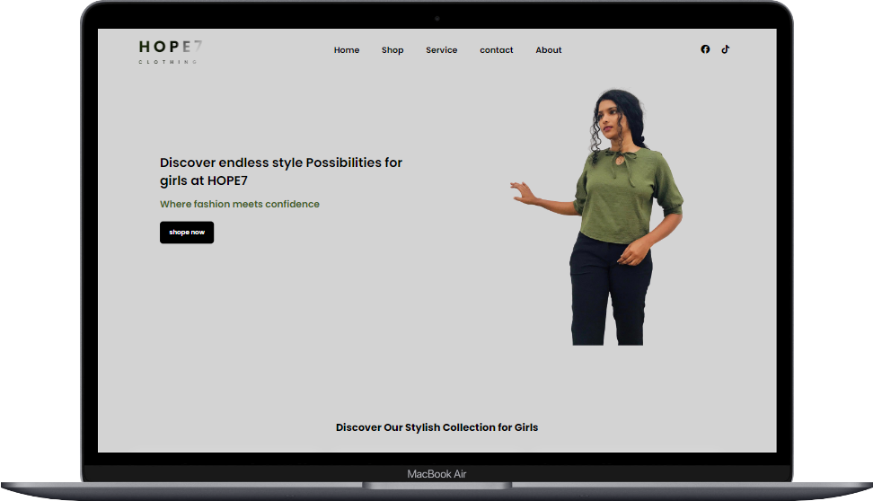
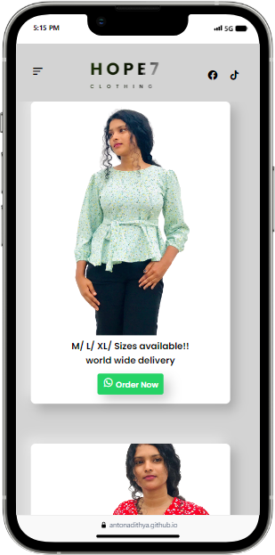
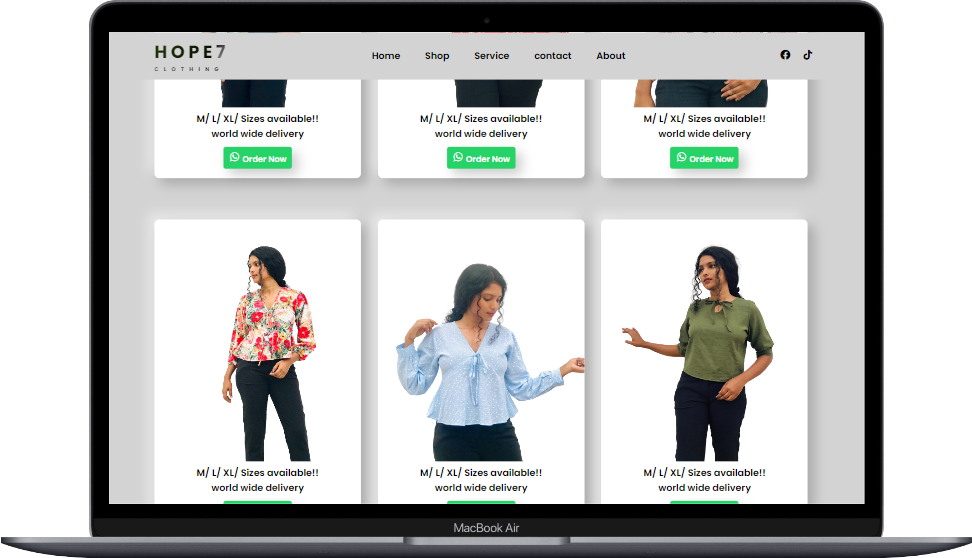

<h1 align="center" id="title">HOPE7 - Girls' Clothing Store</h1>

HOPE7 is an online girls' clothing store that aims to provide a delightful shopping experience for young girls celebrating individuality confidence and style. The project includes a visually appealing website with sections such as Home Shop Service Contact and About offering a range of stylish clothing options for girls. The website also features a global express shipping service and a customer care hub to ensure a worry-free shopping experience.

<h2>🚀 Demo</h2>

[https://antonadithya.github.io/hope7/](https://antonadithya.github.io/hope7/)

<h2>📷 Project Screenshots:</h2>

  
  

<h2>💻 Built with</h2>

Technologies used in the project:

*   HTML
*   JavaScript
*   CSS

<h2>🛡️ License:</h2>

This project is licensed under the This project is licensed under the MIT License.

<h2>🥰 Like my work?</h2>

